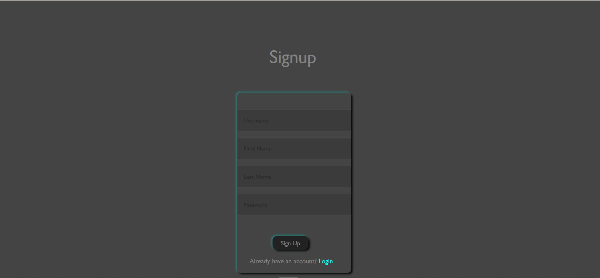

# Chat app

A simple chat application built using socket.io,express JS,node js
## Demo


## SignUp




## Chat Page


## Chatting demo


## Features
- Allows you to SignUp,Login and chat
- Chat with fellow chat app users that are logged in


## Installation

1. Clone the repository:
   ```bash
   git clone https://github.com/HardikKumariscoding/101410993_lab_test1_chat_app

2.   Install dependencies:

        npm install

3. Run the app locally:        

        node server.js


4. Open the app in your browser:

    Visit http://localhost:5000/ to see the chat app in action. 


Technologies Used

    Express JS
    Socket.io
    Bootstrap
